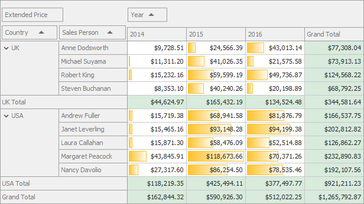

<!-- default badges list -->

<!-- default badges end -->

# Pivot Grid for WinForms - Apply Format Rules to the Data Cells

The following example shows how to apply a data bar format condition (the [FormatConditionRuleDataBar](https://docs.devexpress.com/WindowsForms/DevExpress.XtraEditors.FormatConditionRuleDataBar) class) to the Pivot Grid data cells. The Pivot Grid paints cells placed at the intersection of the `Year` column and the `Sales Person` row with the yellow gradient. A longer bar corresponds to a higher value, and a shorter bar corresponds to a lower value.

<!-- default file list -->
## Files to Review

* [Form1.cs](./CS/WinFormsPivotGridFormatRules/Form1.cs) (VB: [Form1.vb](./VB/WinFormsPivotGridFormatRules/Form1.vb))
<!-- default file list end -->

## Documentation

[Conditional Formatting](https://docs.devexpress.com/WindowsForms/1883/controls-and-libraries/pivot-grid/data-analysis/conditional-formatting)

## More Examples

[How to Display KPI Graphics in the Pivot Grid bound to an MS SQL Data Source](https://github.com/DevExpress-Examples/how-to-display-kpi-graphics-in-pivotgridcontrol-bound-to-a-regular-data-source-t152365)

